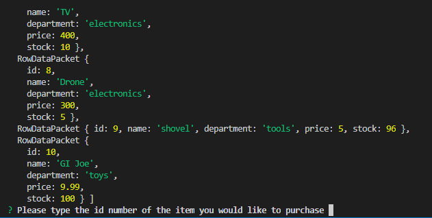
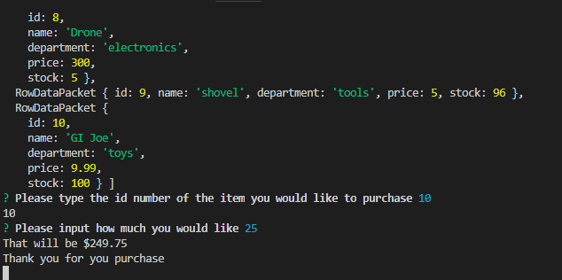

# bamazon

node app that uses a datbase to provide product information

## technology used

javascript
node js
inquirer
MySQL

###instructions
after setting up the database and .env file
you will need to install the required npm packages
then run bamazonCustomer.js
and follow the prompts

shown below example of what happens after starting the program

shown below a completed transaction

